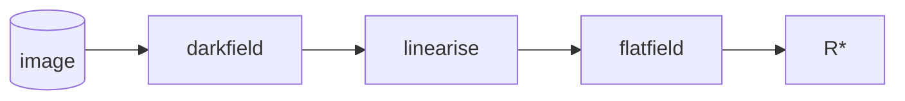

# The PCOT cookbook

This is a repository of useful PCOT documents containing graphs for performing
common tasks. If you don't know what PCOT is, please
[look here for more information](pcot.md). It also 
contains [camera definition files](cameras/).

Typically, the graphs are saved with some small images as
example data. To use your own data, click on the input button at the top of
the screen which corresponds to the input you want to replace (this is almost
always input 0) and load the required input. You may need to ensure that your
data has the bands the graph expects, or edit the graph accordingly.

You will probably have to edit the graph somewhat to produce the
analysis you need, but these will give you a starting point from
which to do that, as well as providing useful examples.

## Analysis documents

These are (hopefully) the "bread and butter" of working with PCOT: loading
data into PCOT documents which process it in a (more or less) obvious 
but at least clearly visible way.

* [Plotting spectra of points](recipes/spectrum.md)
* [False colour spectral parameter map](recipes/parametermap.md)
* [Combined spectral parameter map](recipes/combined.md)

## Calibration

These are scripts or documents which take raw data and process it
into a form ready for analysis. The calibration pipeline is, roughly
speaking, this:

Things will be added here as they are written

## Calibration data prep. scripts

* Darkfield / flatfield preparation

