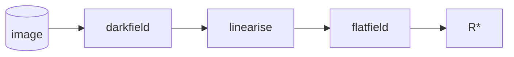

# The PCOT cookbook

This is a repository of useful PCOT documents containing graphs for performing
common tasks. If you don't know what PCOT is, please
[look here for more information](pcot.md). It also 
contains [camera definition files](cameras/index.md).

Typically, the graphs are saved with some small images as
example data. To use your own data, click on the input button at the top of
the screen which corresponds to the input you want to replace (this is almost
always input 0) and load the required input. You may need to ensure that your
data has the bands the graph expects, or edit the graph accordingly.

You will probably have to edit the graph somewhat to produce the
analysis you need, but these will give you a starting point from
which to do that, as well as providing useful examples.

## Analysis recipes and documents

These are (hopefully) the "bread and butter" of working with PCOT: loading
data into PCOT to process it in a (more or less) obvious 
but at least clearly visible way.

* [Plotting spectra of points](recipes/spectrum.md)
* [False colour spectral parameter map](recipes/parametermap.md)
* [Combined spectral parameter map](recipes/combined.md)

## Filter assignment

Ideally, your input setup will assign filters automatically. Sometimes,
however, this isn't possible - perhaps you have files which are 
named strangely, or it's difficult to create a
[regular expression](https://au-exomars.github.io/PCOT/userguide/multifile/#which-image-is-which-filter-setting-a-file-pattern)
which *multifile* can use. In this case you can
[use the *assignfilters* node](recipes/assignfilters.md) to manually assign filters.

## Simple calibration to a white target

Sometimes you have a white (e.g. Spectralon) target in the image
and it's sufficient to calibrate to that. 
[Here is a recipe](recipes/spectralon.md).

## Calibration

These are recipes which take raw data and process it
into a form ready for analysis. For ExoMars data this will normally
happen upstream in the Rover Operations Centre, but that will
not be possible in preliminary work - and PCOT may well be used outside
that setting.

The calibration pipeline is, roughly
speaking, this:

For each band in the image:

* The image has any available darkfield image subtracted from them
* The image is linearised, so that each pixel's value is proportional to intensity
* Each pixel is then divided by the corresponding pixel in the normalised flatfield image, giving a radiance image
* The image is converted from radiance to reflectance ($R^{\star}$) using a calibration target visible in the image

## Calibration data prep. scripts

* Darkfield - yet to be written; it's likely to be a node producing a value which can be subtracted from an image.
* Linearisation - yet to be written; it's likely to be a single node.
* [Flatfielding](recipes/flatfield.md)
* [Entire process](recipes/calibration.md)

