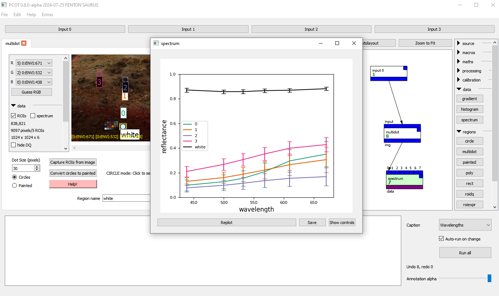

# What is PCOT?

PCOT is the PanCam Operations Toolkit - it's a piece of software originally
designed to process information downloaded from the PanCam (Panoramic Camera)
instrument on the 
[Rosalind Franklin rover](https://www.esa.int/Science_Exploration/Human_and_Robotic_Exploration/Exploration/ExoMars/ExoMars_rover),
part of the
[ExoMars](https://www.esa.int/Science_Exploration/Human_and_Robotic_Exploration/Exploration/ExoMars)
project.

However, PCOT is capable of very much more than this. It can work with
multispectral imagery from almost any source, and can function both as
a program and a library. In particular, it can:

* create spectra of points and regions
* create spectral parameter maps (i.e. images created by performing
calculations across multiple bands in the image - for example, dividing
the 671nm by the 432nm band shows the presence of iron(III) compounds)
* allow entirely arbitrary calculations on images, all while
propagating uncertainty information on a per-pixel basis
* add annotations
* allow simple construction of operations through a visual "programming"
language
* perform pre-scripted operations through use as a Python library

and much more.

See the [main PCOT website](https://github.com/AU-ExoMars/PCOT) for details.

