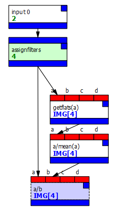
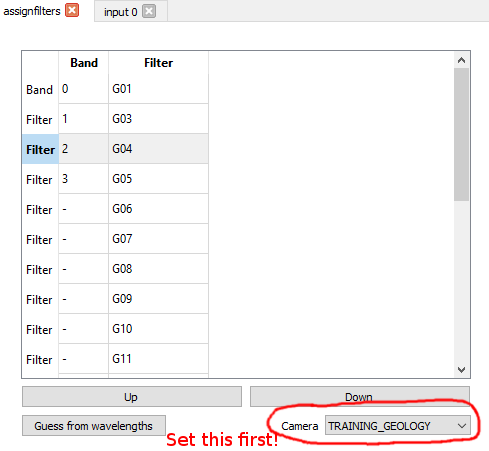

# Manually assigning filters

You can manually assign filters to image bands using the *assignfilters*
node. We haven't supplied a PCOT file for this because it's very simple:
just add the node after the *input* node. 

**Make sure all subsequent use of the image is made via connections to
the *assignfilters* node, not directly to the *input* node.**
If you connect to the *input* directly, the data coming out will not have
any filter or camera information!

Here's an example of assigning filters and then flatfielding; note that all
connections normally made to *input* are now made to the *assignfilters* node:

Once set up, you need to open the *assignfilters* node and select the camera.
You can then move the filters up and down with the Up and Down buttons to
assign them to bands:

