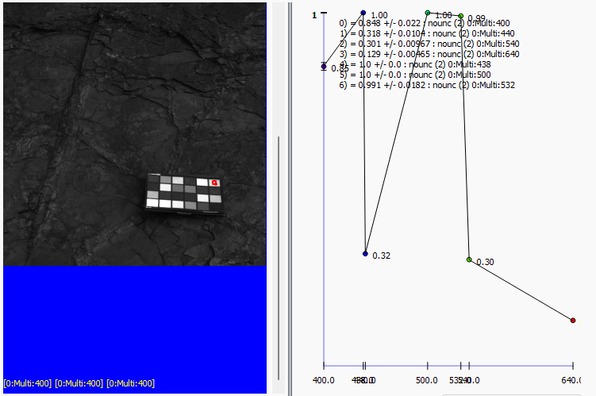
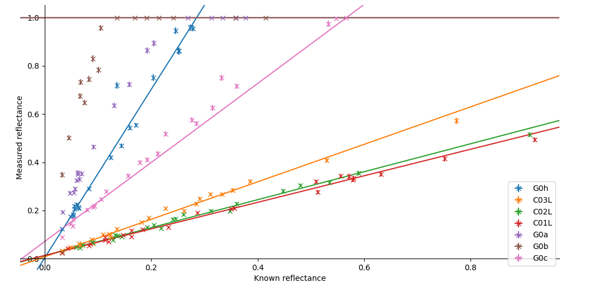
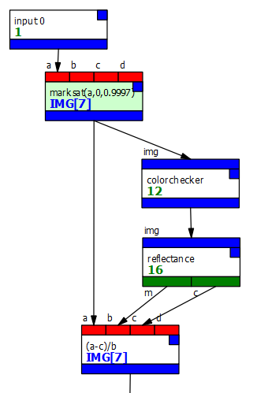
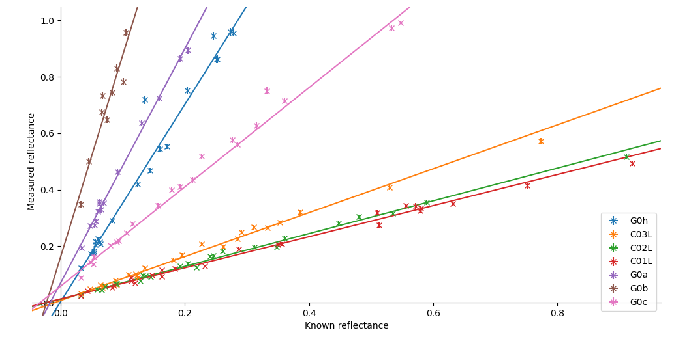

# Calibration with saturated images

!!! info
    Please read the [calibration page](calibration.md) first if you have not
    already. This page won't make a great deal of sense otherwise.
    
    I have not included a graph for this recipe - it's largely the same
    as the calibration recipe.
    

In the [calibration recipe page](calibration.md) we looked at how to calibrate an image 
to produce $R^\star$ (reflectance) from DNs or radiance. This requires a calibration target
to be present in the image[^1].

However, some of the patches in the reflection target may be saturated. 
This data cannot be used for calibration, because it is false - the saturated
patches are brighter than the recorded image can show. 

Consider the image below:



The top-right patch on the ColorChecker target has two saturated bands, shown as "1.00" in the spectrum.
In the case of this particular image, it's not saturated in any of the bands which make up the RGB
image shown in the canvas, but by visual inspection many other patches are saturated in these bands.

If we try to get reflectance parameters $m$ and $c$ by fitting a line to these points, we end up with this mess:



The points for each patch do not fall on a straight line. The saturated points count more in the line fit
because they have lower uncertainty, which is particularly bad for the G0a and G0b filters, in which the saturated
points dominate so strongly we fit a horizontal line!

Ideally, the image should be captured again at a shorter exposure time but this is often[^2] not possible.
However, the *reflectance* patch **will ignore pixels which have been marked as saturated**.
To do this, insert an *expr* node immediately after the input, and set the
expression in that node to 
```
marksat(a,0,0.9997)
```
We're using 0.9997 rather than 1, because typically we're only using 12 bits of the input; for technical reasons
this means that the maximum value from the camera scales to 0.9997711 (65520/65535) inside PCOT. You should see areas
of the image turn magenta, indicating pixels with saturated data in any band (see
[the main PCOT docs](https://au-exomars.github.io/PCOT/userguide/canvas/) for more details on how this works)[^3].

The calibration pipeline should look now something like this:



Looking at the reflectance node, we can see the lines fitted to the patches in each band:



The points are reasonably well aligned for each filter, indicating a good fit.


[^1]: Or at least some image; we can always import calibration
data from one image to another by using multiple inputs.
[^2]: Usually!
[^3]: A future version of PCOT will fix this very slight inaccuracy by taking account of the camera bit depth in PNG image load. The raw loader
should already do this.
