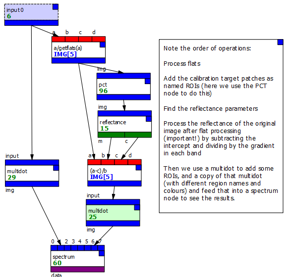
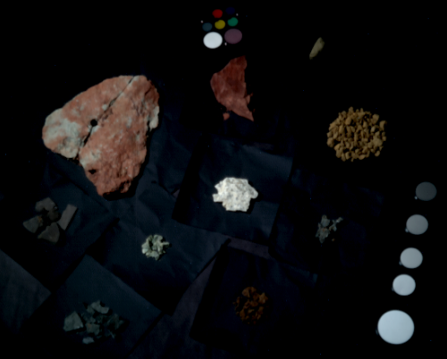
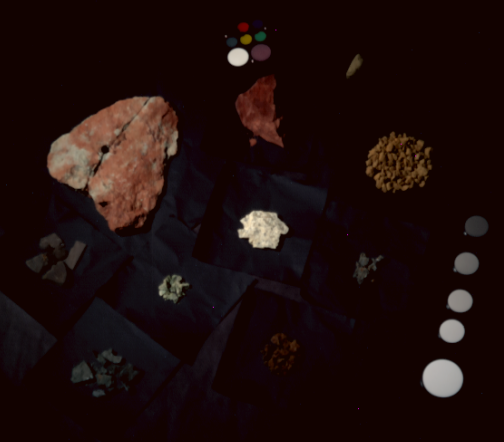

# Calibration process (flatfielding and reflectance)

## Introduction
Here, we process the image with flatfielding and conversion from DNs
to $R^{\star}$. 

In the mission, this process will be done in the ROC - but it's still
useful to be able to perform calibration in PCOT on data (which could be
from other cameras).
Here I'm using the geology filter wheel on the training model (TRAINING_GEOLOGY).

Note that because this process uses flatfields, you need to use a PCOT
camera file which contains flatfield data! You can download the appropriate
file for the training model's geology wheel from the [camera definition files](../cameras/index.md).
It's quite big!

## The graph
Download graph: [calibration.pcot](graphs/calibration.pcot)

Here's the process:

* The **a/getflats(a)** *expr* node looks at the band to filter assignments
in the input image, fetches flatfield images for each band, and divides
the input image by the flatfield for each band.
* The **pct** node locates the PCT in the image and
adds regions of interest for each patch, labelled according with each
patch name as it appears in the reflectance data for the PCT. It's not
an automatic process, but it's not too fiddly.
* The **reflectance** node calculates the known reflectance in each band
for each patch by combining the camera's filter response in that band
by the reflectance spectrum of the patch. It then uses this this information,
along with the measured reflectances (from the image) to
generate gradient and intercept for the conversion to $R^\star$.
* The **(a-c)/b** *expr* node subtracts the intercept and divides by
the gradient to give the calibrated image. **It is important that the image
input (a) should have no regions of interest, so don't take it from the *pct*
node!**

We then use a couple of *multidot* nodes (which create multiple circular regions
of interest). These are the same, apart from the name and label colour
of the regions - one was copied from the other and modified. We feed these
into a *spectrum* so we can see how effective the calibration was.

Here is the input image (taken from the *input* node), showing only the
670nm, 530nm and 440nm bands:

    
Opening the **(a-c)/b** node will show the calibrated result (same
bands shown):

You'll notice that the blue cast in the original image is now mostly gone,
although there the previously black background has a slight red cast (emphasised by the high gamma used for these images). That's an artifact of
the non-zero intercepts in this particular calibration.

Opening the *reflectance* node and clicking on "Replot" will show the 
lines we're calibrating with. You can see that the fit is approximate
because of the data, and that the intercepts are negative.

The *multidot* and *spectrum* nodes combine to show the spectra of the three
brightest spectralon patches (to the right of the image) 
before and after calibration:

Looking at the lighter grey line (S99 before calibration) and its
darker grey calibrated counterpart, we can see the result is much flatter.
The same applies to the other two patches. 

This is a decent result given that the lighting in this particular example
image is non-uniform, and that the PCT is close to the edge.
