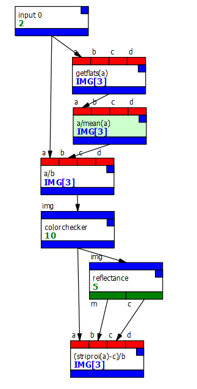
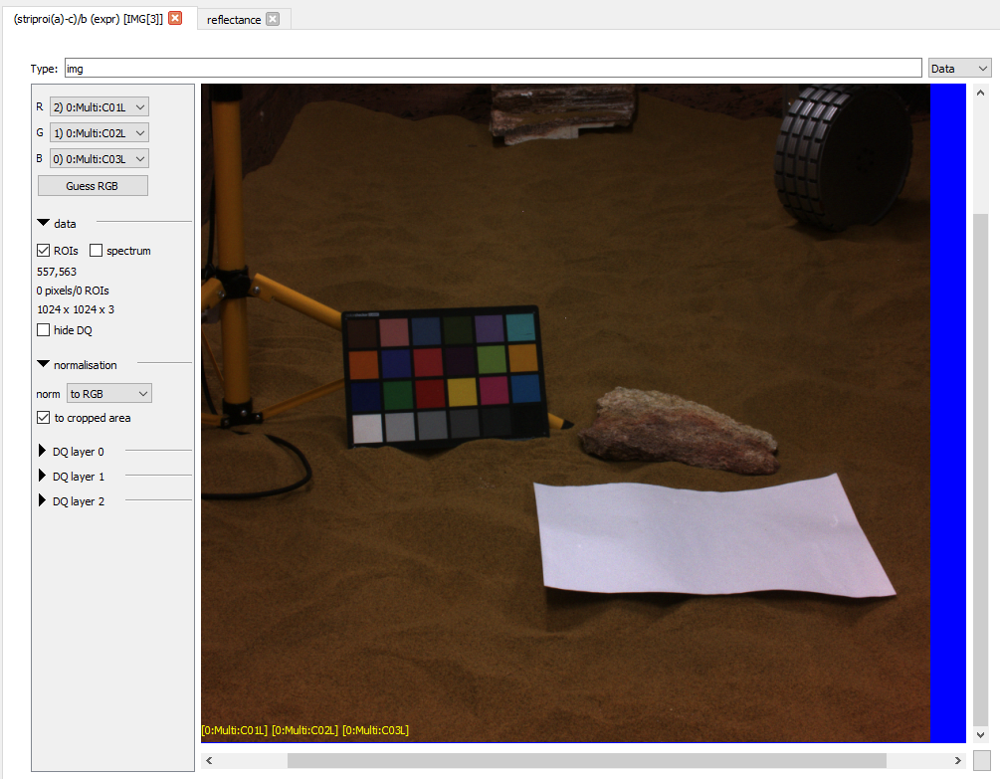

# Calibration process (flatfielding and reflectance)

## Introduction
Here, we process the image with flatfielding and conversion from DNs
to $R^{\star}$. 

In the mission, this process will be done in the ROC - but it's still
useful to be able to perform calibration in PCOT on AUPE images.

Note that because this process uses flatfields, you need to use a PCOT
camera file which contains flatfield data! You can download the appropriate
file for AUPE's left camera from the [camera definition files](/cameras/).
It's quite big!

## A note on the filter ordering
This particular graph uses AUPE data which has an offset in the filter
positions:

* Filter 1: g0a (438nm narrow)
* Filter 2: C03L (440nm broad)
* Filter 3: C02L (540nm broad)
* Filter 4: C01L (640nm broad)
* Filter 5: G0b (500nm narrow)
* Filter 6: G0c (532nm narrow)

This is due to a mismatch in the VelociRAPDr and AUPE software specs,
and should only apply to a few images - notably those captured at the Ries
crater in 2025. For your own images, you'll probably want to use AUPE_LEFT
and modify the input 0 settings. Nevertheless this should give you an
idea of how to set up calibration.

## The graph
Download graph: [calibration.pcot](graphs/calibration.pcot){:download}

Here's the process:

* The **getflats** node looks at the band to filter assignments in the input
image, and outputs flatfields for those bands extracted from the camera
data file.
* The **a/mean(a)** *expr* node divides each band by its mean - we've separated
out this process for the time being to help when we come to processing 
the dark fields.
* The **a/b** *expr* node divides the image bands by the flatfields
* The **colorchecker** node locates the a ColorChecker in the image and
adds regions of interest for each patch, labelled according with each
patch name as it appears in the camera's reflectance data for that calibration
target
* The **reflectance** node uses the patch intensities in each band along
with the reflectance data in the camera file to
generate gradient and intercept for the conversion to $R^\star$
* The **(striproi(a)-c)/b** *expr* node does the following:
    * remove the ColorChecker regions of interest (otherwise only the
    patches would change!)
    * subtract the intercept
    * divide by the gradient
    
Opening that last node will show the final result:

In the node view,
zooming in on the white sheet with normalisation set to RGB and cropped area
only will normalize to the cropped area, normalising the combined range
of the RGB bands. You'll see a slight purple cast. However, zooming in
on the white patch in the target shows a rather better result.

Opening the *reflectance* node and clicking on "Replot" will show the 
lines we're calibrating with (the input is only loading the RGB
bands; you can load more if you wish). You can see that the fit is approximate
because of the data.

