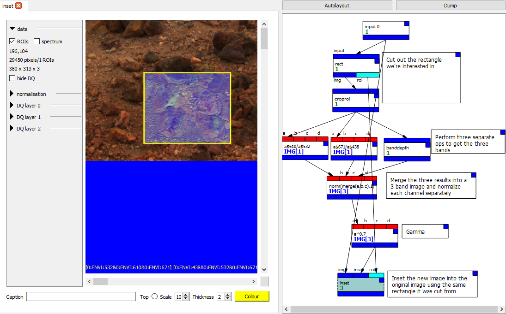

# Combined spectral parameter map

Download graph: [combined.pcot](graphs/combined.pcot){:download}

This is used when we want to show an RGB image where each channel comes
from a different spectral parameter. For example,

`RGB = 610/530, 670/440, BD610`

i.e. 

* red channel = ratio of 610nm/530nm
* green channel = ratio of 670nm/440nm
* blue channel = band depth at 610nm

where the band depth is calculated according to 
Clark and Roush (1984) as given in Viviano and Seelos et al. (2014).

In this graph,

* A *rect* adds a rectangular region of interest - the part of the image we are interested in.
* A *croproi* cuts out this part of the image, producing a new image the same size as the ROI.
* This image is then fed into three different nodes, each of which performs a different operation:
** An *expr* node performs `a$610/a$532` - extracting two bands and creating a new image with their ratio
** Similarly, another *expr* node performs `a$671/a$482`.
** A *banddepth* node finds the band depth at 610nm (double-click the node to view and change parameters)
* These three 1-band images are merged together into a single 3-band image by another *expr* node, which also normalises the result. The optional second argument to the *norm* function is non-zero, which
means we should normalise each channel separately.
* Another *expr* then raises all the pixels to the power 0.7, performing a simple gamma correction.
* Finally, the *inset* node takes the 3-channel image we have just made, and insets it into an RGB representation of the original image as defined by the RGB mappings in the canvas of the *input* node,
using the rectangular ROI we originally used.

If you want to see both images side by side, you can double-click on a tab's
header to pop it out into a separate window. It can be particularly 
useful to have the *rect* node and the *inset* node open at the same time
because you can change the rectangle in the *rect* node and see the changes
reflected immediately in the *inset*.

## References

* [Viviano, Christina E., et al.](https://agupubs.onlinelibrary.wiley.com/doi/full/10.1002/2014JE004627) "Revised CRISM spectral parameters and summary products based on the currently detected mineral diversity on Mars." Journal of Geophysical Research: Planets 119.6 (2014): 1403-1431.
* [Clark, Roger N., and Ted L. Roush.](https://agupubs.onlinelibrary.wiley.com/doi/pdf/10.1029/JB089iB07p06329?casa_token=4baIkVx7KCQAAAAA:IWmxAIAir5P2R6r3bGtzKjzmSOXQJ_3zNMx1TdTRmMsMmhPMZykzqaWMQQa0vNiY9S3EnffWGAWO4NgWNQ) "Reflectance spectroscopy: Quantitative analysis techniques for remote sensing applications." Journal of Geophysical Research: Solid Earth 89.B7 (1984): 6329-6340.

