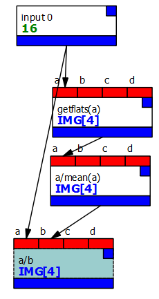
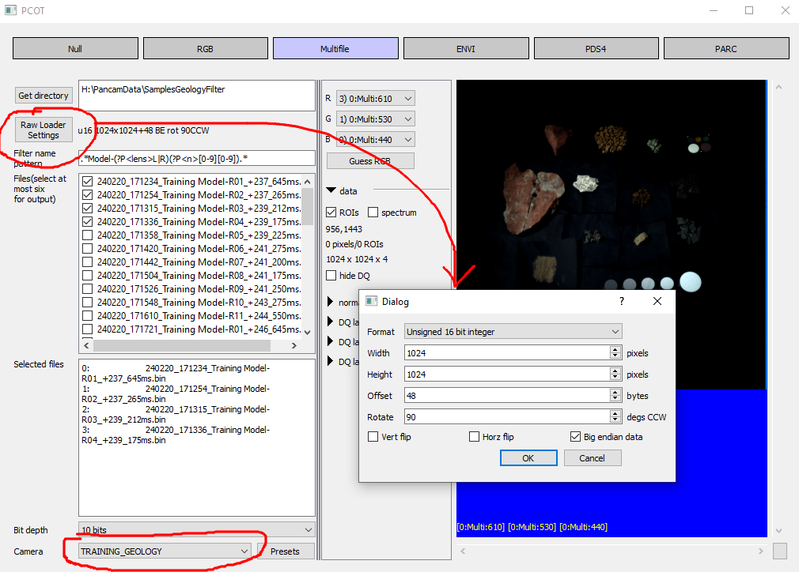
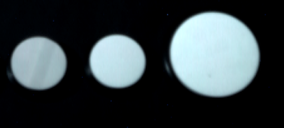
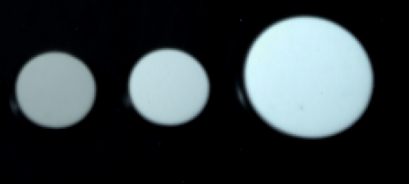
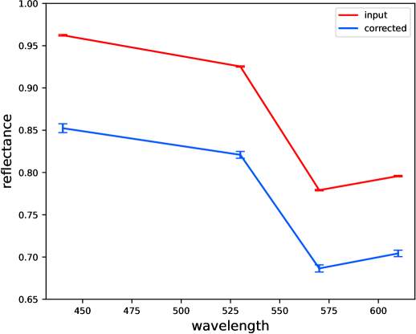

# Flatfielding

Note that because this process uses flatfields, you need to use a PCOT
camera file which contains flatfield data! You can download the appropriate
file for the geology filter wheel in the training model (TRAINING_GEOLOGY)
from the [camera definition files](../cameras/index.md).
It's quite big!

Download graph: [flatfield.pcot](graphs/flatfield.pcot){:download}

Flatfielding - flat-field correction - mitigates irregularities in captured images due to
pixel-to-pixel differences in the camera's detector and optics. We use images of a flat white
field (hence the name), which are stored in the cameras' data files.

The process performed by the graph above is as follows:

* `input(0)` - Bring the image into the graph from input 0. The input node must set the camera
to a camera which has flatfield data.
* `getflats(a)` - this *expr* node looks at the filters used in the image and generates an image
made up of the flatfields for those filters, with the same filter-to-band assignment.
* `a/mean(a)` - the flatfields are divided by their means on a band-by-band basis
* `a/b` - the image is divided by the flatfields.

This might seem a bit inefficient - why not divide the flats by their means when we create them
using `pcot gencam`? - and indeed it is a bit slow. However, the process is going to change later
when we start to use darkfields and other corrections.

As noted above, it's important to specify the correct camera when you capture the image
and to make sure it's being loaded correctly. If you're loading raw images you will
need to set up the raw loader in the multifile input dialog.

Presets for most settings can be loaded and saved using the "presets" box - see
[the multifile input docs](https://au-exomars.github.io/PCOT/userguide/multifile/) for full details.

## Results

To see the effects, look at the image in the input node's canvas. There are some white test patches.
If we look at the third patch from the right, an artifact is clearly visible:

This artifact no longer appears in the corrected image:

You should also bear in mind that the overall intensity of the corrected image will be different,
as we can see from spectra plotted from the middle of the largest white patch:

    
