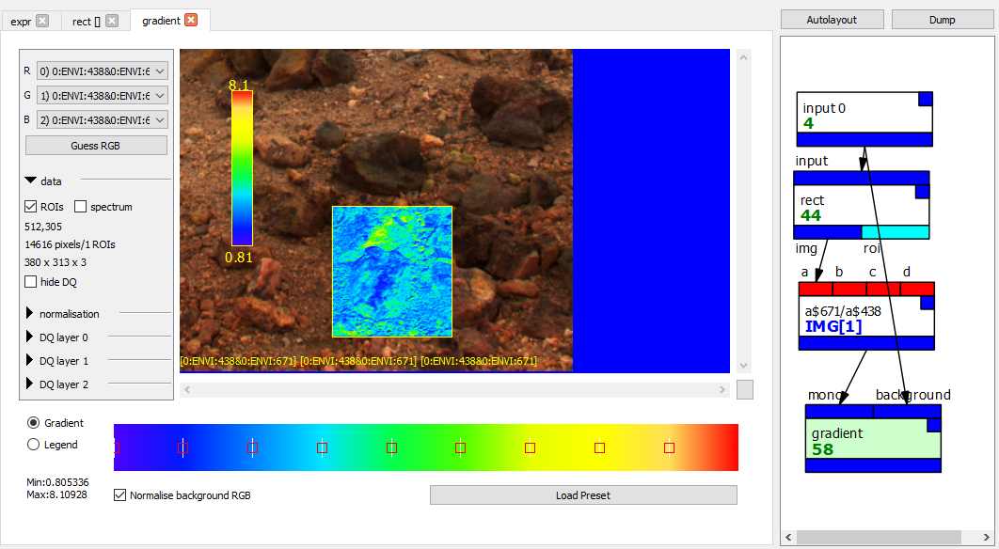

# Spectral parameter map

Download graph: [parametermap.pcot](graphs/parametermap.pcot){:download}

This graph demonstrates a false colour spectral parameter map.

* The input node feeds into *rect* node which adds a rectangular
region of interest. The output of the *rect* is the image with
the ROI; subsequent operations will only be performed on the
ROI (where this makes sense).
* The *rect* feeds into an *expr* which calculates the ratio
between the 671nm and 438nm bands for the ROI. The output
still carries the rectangular region of interest.
* The *gradient* node takes the mono output of the *expr*,
generates a false colour image of the normalised result (but only
the area covered by the ROI)
and insets it into the RGB representation of the input. The position
of the inset is taken from the ROI.

