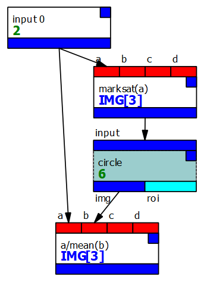

# Simple calibration to a known "white" target

Sometimes all that is necessary is a simple calibration to a 
target in the image, typically a Spectralon patch.

!!!danger
    This process makes a lot of assumptions about the data:
    the response must be linear, and the flat and dark fields
    have already been handled (or are 1 and 0 respectively).
    

This can be done by placing a region of interest on the patch
(ensuring that the pixels are not saturated - use the
`marksat` *expr* function for this) and dividing each band by the mean
of the pixels in that band.

This is shown in the graph below.

Once you have set up the graph and loaded the image, open the `circle` node
(another ROI type could be used) and position the ROI in an area of the target
where there are no saturated pixels ($\ge 1$ or $\le 0$). The `marksat`
expression will ensure these show up as bright magenta (or another colour can
be set using the canvas options). It's probably best to make the area fairly
large if you can to get a good mean.

The $mean$ function will calculate a vector giving the means of each
band in that region, and the division will divide the entire image
by that vector.

