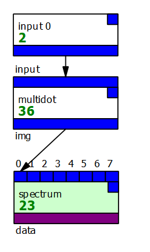
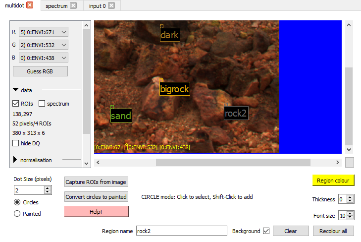
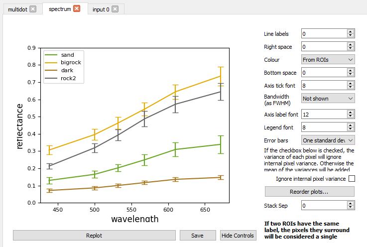

# Plotting spectra of points

Download graph: [spectrum.pcot](graphs/spectrum.pcot){:download}

This graph shows how to plot the spectra of multiple points in an image.
We're actually plotting the spectra of "dots" - small regions of interest.

The *multidot* node creates multiple circular regions of interest and adds
them to an image. It can also create filled or painted ROIs, but that is beyond
the scope of this example.

* To create the ROIs, shift-click on the image.
* Select ROIs by clicking on them - you can then edit their parameters
* ROIs can be clicked and dragged
* All ROIs can be set to random colours using "Recolour all"

    
The *spectrum* node takes images with multiple ROIs and plots a spectrum for each
uniquely named ROI. The pixels from multiple ROIs with the same name will be collated.
This lets you plot combined RWAC and LWAC spectra by creating ROIs with the same name
at the same position in both images, and feeding both images into the node.

